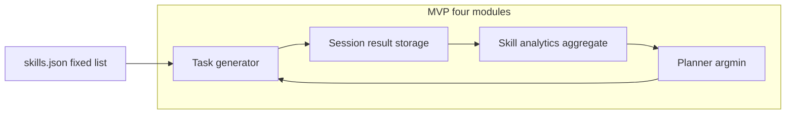

# System redesign: README alignment (MVP-simplified)

## Product narrative (differentiation)

**Positioning (one line):**  
We are not "another IELTS practice app" but a **skill diagnosis system for IELTS** — *We don't just give you practice. We show you exactly which IELTS skills you are improving.*

| Typical product | This product |
|-----------------|--------------|
| Generate questions | **Structured learning data** (user × skill × accuracy × band) |
| Score / XP | **Learning transparency** — which micro-skills moved after a session |
| Flat reading % | **Skill-level diagnosis** (e.g. paraphrase 40% vs scanning 85%) |

**What actually differentiates the product:** not "more AI" but **accurate, fixed micro-skill tagging** → honest analytics → adaptive next step. If tags are wrong, dashboards and the planner are wrong.

---

## Current state vs target

| Pillar | Today |
|--------|--------|
| Four-skill diagnostic | Implemented |
| Per-question `skill_id` | Missing |
| Skill analytics | Missing (no per-item skill outcomes) |
| Planner | Missing |
| Session "Strengthened / Needs work" | Missing |
| `skill_graph/v1` versioning | **Out of scope for MVP** — use one `skills.json` |
| `skill_metrics` collection | **Out of scope for MVP** — **aggregate from `results`** |

**Conclusion:** Evolve the monolith; the closed loop is: **generate (tagged) → submit → store per-question rows → aggregate → plan → generate.**



---

## MVP: four minimal modules (no extra collections required)

1. **Task generator** — Input: `skill` (module), `difficulty`, optional `focus_skill` (micro_skill_id). Output: questions each with `skill_id` + `difficulty`, **chosen only from the fixed list** (see below).
2. **Session / result** — Store **per question**: `user`, `question_id`, `skill_id`, `correct` (and session refs as today). This is the ground truth for analytics.
3. **Skill analytics** — `GROUP BY skill_id` (and filters on user, time window): `accuracy = sum(correct)/count(*)`. **Materialized `skill_metrics` later** if query cost or scale demands it.
4. **Planner** — `focus_skill = argmin(skill_accuracy)` (with floors / minimum attempts later). Mastery-learning minimal rule.

---

## Fixed IELTS micro-skill taxonomy (37 tags)

**Rule:** Taxonomy is **fixed**. The LLM **must not invent** labels like "implicit reasoning" — only **choose from the enum** for the active module. Prompts pass the allowlist; validation rejects unknown `skill_id` server-side if desired.

**ID format (example):** `R2.2_paraphrase_recognition` (module + cluster + human-readable tail).

| Module | Clusters / micro-skills (count) |
|--------|---------------------------------|
| **Reading (12)** | **R1 Information Navigation:** `R1.1_skimming_main_idea`, `R1.2_scanning_specific_information`, `R1.3_paragraph_topic_identification` — **R2 Lexical and Paraphrase:** `R2.1_synonym_matching`, `R2.2_paraphrase_recognition`, `R2.3_keyword_mapping` — **R3 Detail:** `R3.1_factual_detail_extraction`, `R3.2_comparison_identification` — **R4 Logical:** `R4.1_inference_from_context`, `R4.2_cause_effect_reasoning` — **R5 Global:** `R5.1_author_opinion_identification`, `R5.2_argument_structure` |
| **Listening (8)** | **L1 Speech:** `L1.1_connected_speech_recognition`, `L1.2_number_and_spelling_recognition` — **L2 Capture:** `L2.1_specific_detail_capture`, `L2.2_form_completion` — **L3 Meaning:** `L3.1_paraphrase_recognition`, `L3.2_speaker_intention` — **L4 Context:** `L4.1_inference_from_dialogue`, `L4.2_attitude_detection` |
| **Writing (9)** | **W1 Task:** `W1.1_task_response_completeness`, `W1.2_idea_relevance` — **W2 Organization:** `W2.1_paragraph_structure`, `W2.2_logical_flow`, `W2.3_cohesion_devices` — **W3 Lexical:** `W3.1_vocabulary_range`, `W3.2_paraphrase_usage` — **W4 Grammar:** `W4.1_grammar_accuracy`, `W4.2_sentence_complexity` |
| **Speaking (8)** | **S1 Fluency:** `S1.1_speech_continuity`, `S1.2_hesitation_control` — **S2 Pronunciation:** `S2.1_clarity_of_pronunciation`, `S2.2_stress_and_intonation` — **S3 Lexical:** `S3.1_vocabulary_range`, `S3.2_paraphrase_usage` — **S4 Grammar:** `S4.1_grammar_accuracy`, `S4.2_sentence_complexity` |

**Question payload (target shape):**

```json
{
  "question_id": "q1",
  "skill_id": "R2.2_paraphrase_recognition",
  "difficulty": "band6"
}
```

**User-facing session summary (learning visibility):**

```text
Strengthened: scanning_specific_information, synonym_matching
Needs improvement: paraphrase_recognition, inference_from_context
```

---

## 1. Domain: single config file (no versioning in MVP)

- One file e.g. [`backend/config/skills.json`](backend/config/skills.json): modules → clusters → `{ id, label, description }` for UI and prompts.
- **Later:** if taxonomy changes often, introduce `skill_graph/v2` — not blocking MVP.
- **Pydantic:** extend [`Question`](backend/models.py) with `skill_id`, `difficulty`; optional on read for legacy sessions.

---

## 2. Data layer: results-first analytics

- **No separate `skill_metrics` collection in MVP.**
- Extend **results** (or embedded per-question subdocs) so each scored item contributes `{ skill_id, correct }` to aggregation pipelines.
- **Indexes:** support `user_id + completed_at` and paths that `group` by `skill_id` (exact index design follows Mongo shape chosen for per-item rows).
- **Rename** `DB_NAME` still optional; document migration.
- **Future:** materialized `skill_metrics` or scheduled rollups when data volume or read latency requires it.

---

## 3. AI layer: constrained tagging (critical)

- **Generators** ([`ai.py`](backend/ai.py), [`agents.py`](backend/agents.py)): system/user prompt includes **only the allowlist** for the current module (e.g. Reading: 12 IDs). Instruction: *You MUST set each question's `skill_id` to one of these values exactly.*
- **Validation:** reject or map unknown IDs before save to protect analytics integrity.
- **Diagnosis:** Phase 1 = pure aggregation from stored tags. LLM "skill diagnosis" for open-ended (W/S) can output **criterion-mapped** scores; mapping rubric subscores → micro_skills is a follow-on if you want W/S per-tag accuracy comparable to R/L.
- **Planner:** `recommended_focus` = weakest micro_skill (by aggregated accuracy, min attempts threshold optional).
- **Dead code:** remove or wire `supervisor_agent` / `reading_agent` to avoid two generation stories.

---

## 4. API surface

- `GET /api/learning/skill-map` — built from **aggregation** on results (optionally time-bounded).
- `POST /api/practice/generate` (extend) — `use_adaptive`, `focus_skill` overrides; `target_band` on user.
- `GET /api/learning/next-step` — copy for hub from planner + taxonomy labels.
- `GET /api/learning/weekly-report` — last 7 days, aggregated on read from results.
- Session submit responses include **Strengthened / Needs work** using same rules (e.g. top gainers and bottom skills this session).

---

## 5. Frontend

- [`PracticeHub`](frontend/src/pages/PracticeHub/index.jsx): recommended next practice + narrative aligned to **skill diagnosis**.
- Skill map / bars: one row per **micro_skill_id** (labels from `skills.json`).
- Post-submit: Strengthened / Needs work.
- [`ProgressPage`](frontend/src/pages/ProgressPage/index.jsx): weekly strip + filter by module/micro-skill when data exists.
- [`api.js`](frontend/src/services/api.js): new calls for skill-map, next-step, weekly, session summary fields.

---

## 6. Scaling and async (unchanged intent)

- MVP: sync LLM; UI handles timeouts.
- Later: external queue for long W/S analysis if Vercel limits bite.

---

## 7. Out of scope (unchanged)

- Vocab: auxiliary, non-blocking.
- Docker/CI: optional.

---

## Delivery order (revised)

1. **`skills.json` + Pydantic + result schema** (per-question `skill_id`, `correct`).  
2. **Generators: constrained allowlist in prompt + validation.**  
3. **Submit path writes per-item rows; aggregation queries for skill map.**  
4. **Planner + APIs + session summary.**  
5. **Frontend: hub, map, Strengthened/Needs work, progress.**  
6. **Polish:** DB rename, dead agent cleanup; **later** materialized metrics and taxonomy versioning if needed.

**Success metric for the loop:** a session produces defensible per-skill numbers and a **true** "weakest skill → next practice" without relying on a second metrics store in MVP.
