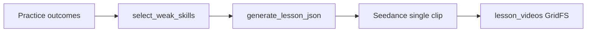
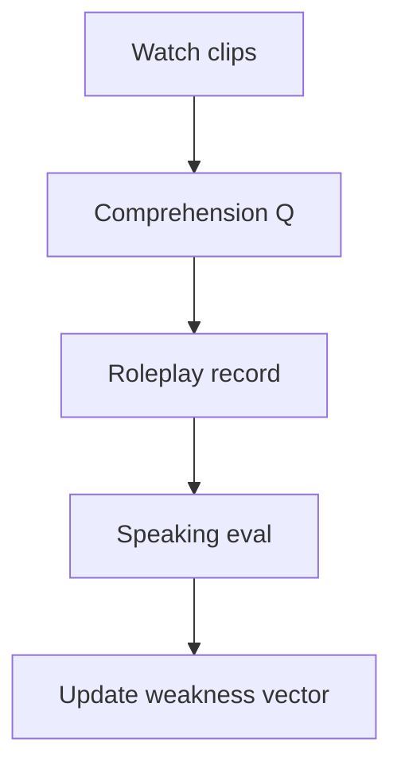

# IELTS AI 视频体系与现有代码对齐计划

## 现状（基线）

- **弱点入口**：[backend/lesson_selection.py](backend/lesson_selection.py) 按模块聚合 `aggregate_skill_accuracy_for_user`，用 `(1-accuracy)*log(n+1)` 排序微技能；[backend/main.py](backend/main.py) `POST /api/lessons/generate` 可选 `skill_id` 或仅 `module`（自动取排名第一的微技能）。
- **内容生成**：[backend/lesson_agent.py](backend/lesson_agent.py) 只产出固定形状：`title`、`slides[]`、`narration`（偏「讲解型 motion graphics」口播稿，约 2–4 分钟朗读量）。
- **视频**：[backend/lesson_video_openrouter.py](backend/lesson_video_openrouter.py) 经 OpenRouter 调用 **bytedance/seedance-2.0**，时长受环境变量约束在 **约 4–15 秒**；[backend/lesson_pipeline.py](backend/lesson_pipeline.py) 把整课压成 **单一 text-to-video prompt**（`build_seedance_video_prompt`），与「场景片 + model answer + breakdown + 练习」的多段结构不一致。
- **持久化**：[backend/database.py](backend/database.py) `lesson_videos` 存 `module`、`skill_id`、`slides_json`、`narration`、`gridfs_file_id` 等；API 模型见 [backend/models.py](backend/models.py) `LessonDetail`（无 `lesson_kind`、`topic`、`scenario`、听力脚本、字幕、练习字段）。




## 与你的设计文档的核心差距


| 维度    | 文档目标                                   | 当前实现                                                                               |
| ----- | -------------------------------------- | ---------------------------------------------------------------------------------- |
| 课型    | Speaking 场景课 / Listening 视频化 / 听→说合成任务 | 统一一种「微技能讲解 + 短视频」                                                                  |
| 课包结构  | scenario、model、breakdown、practice、评估对齐 | 仅 slides + narration                                                               |
| 视频叙事  | 多段、可 3–4 分钟总时长                         | 单段 4–15s 生成视频                                                                      |
| 维度    | Skill × Topic × Difficulty × Scenario  | 仅 module + `skill_id`（来自 [backend/config/skills.json](backend/config/skills.json)） |
| 语音/字幕 | ElevenLabs、chunk 高亮字幕                  | 依赖视频模型 `generate_audio`，无 VTT                                                      |
| 闭环    | 课后录音 → AI 评分 → 再驱动弱点                   | 未与 lesson 绑定                                                                       |
| 编排    | 学习路径、依赖、递进                             | 每节课孤立；无 graph                                                                      |


---

## 三个关键架构决策（决定能否演进到 AI Curriculum Compiler）

### 1. Lesson Graph（学习路径，不仅是孤立 lesson）

**问题**：只有 `lesson_videos` 文档时，推荐只能「再生成一节弱技能课」，难以表达「基础 collocation → travel 场景 → city life」递进。

**建议**：新增 `**lesson_graph`**（独立 collection 或首批嵌入 `lesson_videos` 的可选字段），至少包含与推荐相关的键与边：

- `lesson_id`、`skill` / `micro_skill`（可与现有 `skill_id` 对齐）、`topic`、`scenario`、`band` 或 `difficulty`
- `prerequisites[]`、`next_lessons[]`（存 `lesson_id` 或「模板节点 id」视实现而定）

**价值**：把 recommendation 从「单点排序」升级为「可遍历路径」，为 **Curriculum Compiler** 提供边。

### 2. Weakness Vector（比单一 `skill_id` 更强的 targeting）

**问题**：`select_weak_skills_for_user` → 取 **排名第一** 的 `skill_id`，多维度弱点被折叠成一个选择。

**建议**：维护可持久化的 **weakness vector**（数值可为 0–1 的 weakness 强度或置信度），例如：

```json
{
  "fluency": 0.52,
  "collocations": 0.31,
  "grammar_complexity": 0.61,
  "pronunciation": 0.73
}
```

**落地顺序**：

1. 短期：从现有按 `skill_id` 的 accuracy 映射到向量各分量（与 taxonomy 字段对齐）。
2. 中期：口语/写作 evaluation JSON 中细粒度标签回填向量（与现有聚合逻辑衔接）。

**价值**：`lesson_selector` 可按向量加权选模板、选 topic/scenario、或一次排队生成多节优先级队列。

### 3. Curriculum 显式 **difficulty**（控制 progression）

在计划的 `curriculum` 子文档中，除 `topic`、`scenario_id`、`band_target` / `accent` 外，**必须**加入规范化 **difficulty**（例如 `band6`、`upper_intermediate`），与 `lesson_graph` 的边一起使用，否则长期难以做难度曲线与 compiler 输出。

---

## 推荐目标：单课文档形态（与实现渐进对齐）

以下作为 **north-star** 形态；第一阶段可先子集落地（例如仅 `clips[0]` + `content` 部分字段）。

```json
{
  "lesson_id": "...",
  "lesson_kind": "speaking_scenario",
  "curriculum": {
    "skill": "speaking",
    "micro_skill": "collocations",
    "topic": "travel",
    "scenario": "airport_checkin",
    "difficulty": "band6"
  },
  "content": {
    "model_answer": "...",
    "highlighted_phrases": [],
    "explanation": "...",
    "practice_prompt": "...",
    "listening_dialogue": []
  },
  "clips": [
    { "type": "scenario", "gridfs_file_id": "..." },
    { "type": "explanation", "gridfs_file_id": "..." }
  ],
  "evaluation_hook": {
    "type": "speaking_response",
    "target_micro_skill": "collocations"
  }
}
```

与旧数据兼容：`clips` 缺省时把单一 `gridfs_file_id` 视为 `clips: [{ type: "legacy", ... }]`。

---

## Lesson Generator → Curriculum Compiler


| 能力   | Lesson Generator | Curriculum Compiler                                                      |
| ---- | ---------------- | ------------------------------------------------------------------------ |
| 输入   | 单次弱点 / skill     | weakness vector + graph + 目标 band                                        |
| 输出   | 一节课              | **有序** 课序列 + 依赖 + 难度递进                                                   |
| 依赖数据 | lesson 文档        | **Skill Graph**（skills → micro-skills → prerequisites）+ **Lesson Graph** |


**Skill Graph**：在 [backend/config/skills.json](backend/config/skills.json) 或旁路配置中逐步增加 **依赖边**（不必一次建全）；供 compiler 排序与解释「为何先上这节课」。

---

## 推荐演进路线（分阶段）

### 阶段 A — 数据契约与课型（schema-first）

在 `lesson_videos` 与 API 上引入：

- `**lesson_kind`**：`speaking_scenario`、`listening_context`、`listening_to_speaking`、兼容项 `skill_explainer` / `legacy_motion`。
- `**curriculum`**：`topic`、`scenario`（或 `scenario_id`）、`**difficulty`**、`band_target`、`accent` 等。
- `**content**`（或命名 `content_json`）：`model_answer`、`highlighted_phrases`、`explanation`、`practice_prompt`、`listening_dialogue`、听力题与 replay cue 等 — 先保证 **可存、可 API 返回、前端可读**。
- `**clips[]`**：每元素 `type` + `gridfs_file_id`（或外链）；替代「每课单 `gridfs_file_id`」的隐含假设。
- `**evaluation_hook`**：类型 + `target_micro_skill`，供阶段 D 绑定 speaking 评估。

涉及文件：[backend/database.py](backend/database.py)、[backend/models.py](backend/models.py)、[backend/lesson_pipeline.py](backend/lesson_pipeline.py)、前端 Lessons 相关页与 [frontend/src/services/api.js](frontend/src/services/api.js)。

### 阶段 B — LLM：结构化 Weakness → Lesson

- 输入 contract 含 `lesson_kind`、`curriculum`、`weakness_vector`（或子集）。
- Pydantic 校验输出 + `json_repair`；代码内 **weakness → template** 映射表。
- Topic/scenario 从 **池子** 采样或约束 LLM 只选 id，减少漂移。

### 阶段 C — 视频策略：**默认 C1（强烈推荐）**

- **Seedance + 多 `clips` + 前端 playlist**（便宜、快、稳定）；每段仍 4–15s。
- **C2**（Sora/Kling/ElevenLabs 等）仅在确有产品需求时引入；流水线变为多 provider、长任务队列。

阶段 A/B 可在不选 C2 的情况下完成大部分教学数据结构与播放器体验。

### 阶段 D — Listening → Speaking 闭环（学习效果核心）

目标流程：

```text
watch dialogue
→ answer comprehension questions
→ roleplay (student as role)
→ AI speaking evaluation
→ update weakness vector
```

数据上依赖：`content` 中的对话与题目、`evaluation_hook`、以及评估结果写回用户 weakness 存储的路径定义（与现有 `aggregate_skill_accuracy` 并行或融合）。




### 阶段 E — Lesson Graph + Compiler（后移但架构上预留）

- 实现 `lesson_graph`（或等价）与基于 **Skill Graph** 的排序。
- 「compiler」API：输入 vector + 目标周/目标 band，输出有序 `lesson_id[]` 或生成队列。

### 阶段 F — 规模化与运营

- Phrase pool / 去重、触发阈值、**job queue**（超出 `BackgroundTasks` 时）、速率限制；C2 可选。

---

## 关键依赖与风险

- **时长**：Seedance 单段上限约 15s；长体验靠 **clips + 前端串联**，而非单文件分钟级。
- **评估数据源**：客观题 accuracy → 向量；口语细粒度需与 `evaluation` 字段契约一致。
- **图与向量并存**：避免重复真相源 — graph 边可与「同 micro_skill + topic + difficulty」索引规则同步生成。

---

## 建议默认优先级

1. 阶段 A（含 **difficulty**、**clips[]**、**evaluation_hook**）+ 阶段 B
2. **Weakness vector** 与选课逻辑升级（可与 A 后半并行）
3. 阶段 C1 + 前端 playlist
4. 阶段 D（听→说闭环 + 写回向量）
5. **Lesson Graph** + **Skill Graph** 边 → 阶段 E Compiler
6. 再评估 C2 与 scale-ops

---

## 闭环目标结构（与 Duolingo 级架构对齐）

```text
practice data
→ weakness detection (vector)
→ lesson selector (graph-aware, optional)
→ lesson generator
→ video production (multi-clip)
→ lesson player
→ evaluation
→ weakness vector update
```

