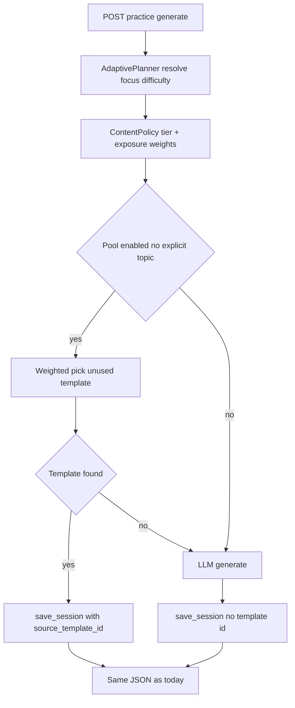

# Hybrid learning content system (template pool + policy)

## Product framing (not “question cache”)

This is a **controlled learning exposure** system, not a mere cache of LLM output:

- **Template pool** = stable content distribution you can measure and improve (`source_template_id` = **content provenance** for effectiveness analysis, quality flags, and avoiding “quiz app” blindness).
- **LLM fallback** = coverage and long tail when the pool does not match policy or is exhausted.
- **Session storage** remains ground truth for analytics; skill analytics stay downstream.

Structure:

```text
Template pool (deterministic distribution)
        ↓
Fallback LLM (generative)
        ↓
Session storage (ground truth)
        ↓
Skill analytics
```

## Goals (unchanged mechanics, expanded intent)

- **Fast path**: `/api/practice/generate` serves pre-built sessions when policy selects a usable template.
- **Buckets**: `skill`, `difficulty` (`band4`–`band8`, [`difficulty_string_from_band`](backend/learning.py)), `focus_micro_skill` on template (nullable = wildcard), writing [`writing_task_type`](backend/models.py).
- **Dedup**: Same user does not receive the same `source_template_id` twice (until a future reset policy).
- **Fallback**: Existing agents when no template survives policy + filters.
- **Scope**: **Practice only** — [`/api/diagnostic/generate`](backend/main.py) unchanged for MVP.

## Architecture: order of operations (critical)

Avoid **pick template → give user**. Use:

```text
Adaptive Planner (already: diagnostic band, optional recommend_focus_skill)
        ↓
Content Policy Layer (what distribution to sample this turn)
        ↓
Practice Template DB (weighted pick among eligible, unused rows)
        ↓
LLM fallback engine
```

**Planner inputs today** (reuse, do not duplicate): [`_resolve_practice_focus`](backend/main.py) — `use_adaptive` → [`recommend_focus_skill`](backend/learning.py) + [`aggregate_skill_accuracy_for_user`](backend/database.py); `target_band` / `focus_skill` overrides.

**Content Policy Layer** (new code, small module e.g. `backend/content_policy.py`):

1. Takes: `module` (skill), planner outputs (`focus_micro_skill` candidate, `difficulty`), `user_id`.
2. Emits: a **sampling intent** for this request — which **tier** of micro-skill targeting to use (below) and optional **template row weights** derived from exposure.
3. **Does not** embed Mongo queries for templates; it only constrains what `practice_pool.pick_template` should prefer.

## Risk controls (your three points, made implementable)

### 1) Frozen learning distribution → sampling pressure

**Problem**: If selection is uniform over templates, the **pool’s fixed skill mix** overrides adaptivity.

**Mitigation**: **Exposure-aware weights** when choosing among eligible templates (after tier + unused filter):

- From recent practice (e.g. last `N` sessions or 7 days), count how often each `skill_id` appeared in completed work (from `results.result_data.skill_outcomes` and/or question-level `skill_id` on sessions — use whichever is already reliable in DB).
- Weight template `T` roughly as `1 / (ε + exposure(planner_focus))` or aggregate over `skill_id`s present in `T.session_data.questions` (for R/L) / primary template `focus_micro_skill` (for W/S prompts).
- **MVP simplification**: weight only by template’s `focus_micro_skill` if set, else uniform among wildcards.

Env e.g. `PRACTICE_EXPOSURE_WINDOW_DAYS=7`, `PRACTICE_EXPOSURE_EPS=0.5`.

### 2) Micro-skill overfitting → three-level sampling

**Problem**: Always preferring exact `focus_micro_skill` match behaves like a drill engine and hurts transfer.

**Mitigation**: **Stochastic tier** each request (defaults tunable via env):

| Tier | Meaning | Default probability |
|------|---------|---------------------|
| Level 1 | Exact micro-skill match (template `focus_micro_skill == planner focus`) | 30% |
| Level 2 | Same **cluster** as planner focus in [`skills.json`](backend/config/skills.json) | 50% |
| Level 3 | Same module only (`focus_micro_skill` null or any in module) | 20% |

Implementation note: taxonomy already has `modules → clusters → skills`. Add a helper e.g. `get_cluster_id_for_skill(skill_id) -> Optional[str]` in [`skills_taxonomy.py`](backend/skills_taxonomy.py) by scanning `_raw()` once (cached).

If a tier has **no eligible unused template**, fall through to the next tier, then to LLM fallback.

Env e.g. `PRACTICE_SAMPLE_EXACT=0.3`, `PRACTICE_SAMPLE_CLUSTER=0.5`, `PRACTICE_SAMPLE_MODULE=0.2` (normalized if they do not sum to 1).

### 3) Pool vs adaptive → Content Policy Layer

Explicitly **separate** “what should be practiced this turn” (planner + policy tiers + exposure) from “which row to fetch” (DB + dedup). The plan’s flow diagram below reflects this.

## Data model

**Collection: `practice_templates`**

| Field | Purpose |
|--------|--------|
| `_id` | Stable template id |
| `skill` | reading \| listening \| writing \| speaking |
| `difficulty` | e.g. `band6` |
| `focus_micro_skill` | `null` (wildcard) or taxonomy id; for tier matching |
| `writing_task_type` | writing only; `null` elsewhere |
| `session_data` | Same shape as `sessions.session_data` today |
| `active` | soft-delete / quality gate |
| `created_at` | ISO |

**Indexes**: compound on `{skill, difficulty, active, writing_task_type}` + index useful for listing by `focus_micro_skill` (or in-memory filter if collection is small at first).

**`sessions` extension**: `source_template_id: Optional[str]`.

## Selection algorithm (revised)

[`practice_pool.pick_template`](backend/practice_pool.py):

1. If pool disabled, explicit `topic` on request (keep “skip pool” rule), or policy says LLM-only → return `None`.
2. **Content policy** chooses tier (Level 1/2/3) from planner focus + random draw.
3. Build candidate template IDs matching `skill`, `difficulty`, writing type, and **tier constraint** on `focus_micro_skill` / cluster / module.
4. Remove **already used** by `user_id` (`sessions.source_template_id`).
5. **Weighted random** among survivors using exposure pressure (§1).
6. Optional: relax `difficulty` ±1 band if empty (`PRACTICE_POOL_RELAX_DIFFICULTY=1`).
7. If still empty → `None` → LLM.

## Wire `/api/practice/generate`

In [`main.py`](backend/main.py):

1. `_learner_band_hint` + `_resolve_practice_focus` (planner).
2. If `USE_PRACTICE_TEMPLATE_POOL`: `picked = await pick_template(...)` with policy + pool.
3. If `picked`: `save_session(..., source_template_id=picked["_id"])`.
4. Else: existing agent calls; `source_template_id=None`.

Response shape unchanged.

## Seed content and tooling

Same as before: `backend/config/practice_templates/`, import script, optional LLM batch export for review. Seed templates should include **diverse `focus_micro_skill` and clusters** over time so Level 2/3 tiers have inventory.

## Flow (mermaid)



## Testing / verification

- Pool + policy: distribution smoke test over many draws (exact vs cluster vs module roughly matches configured ratios).
- Same user does not repeat `source_template_id` until pool exhausted.
- With tiny pool, verify tier fallthrough and LLM fallback.
- Submit/score paths unchanged.

## Files to touch

- [`backend/database.py`](backend/database.py) — collection, indexes, `save_session`, exposure query helper
- [`backend/skills_taxonomy.py`](backend/skills_taxonomy.py) — cluster lookup for Level 2
- New: [`backend/content_policy.py`](backend/content_policy.py) — tier draw + exposure weights
- New: [`backend/practice_pool.py`](backend/practice_pool.py) — eligibility, dedup, weighted pick
- [`backend/main.py`](backend/main.py) — call order
- New: config dir + [`backend/scripts/seed_practice_templates.py`](backend/scripts/seed_practice_templates.py)
