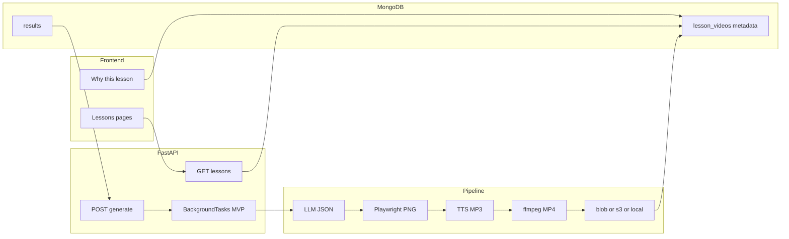

# Weakness-driven AI lesson videos (compose MVP)

## Architecture review (incorporated)

The overall design stays **clean**: reuse the skill taxonomy, pipeline layers **selection → generation → rendering → storage**, MVP scope with BackgroundTasks + ffmpeg, aligned with **practice → skill outcomes → weakness → lesson → practice**. The sections below fold in maintainability, cost, and extension feedback.

## Current state

- `[frontend/src/pages/LessonsPage/index.jsx](frontend/src/pages/LessonsPage/index.jsx)` and `[frontend/src/pages/LessonsPaperPage/index.jsx](frontend/src/pages/LessonsPaperPage/index.jsx)` are **static placeholders**; no lessons API or DB collection.
- **Weak “knowledge points”** already exist as micro-skill IDs (e.g. `R2.1_synonym_matching`) with labels/descriptions in `[backend/config/skills.json](backend/config/skills.json)` / `[backend/skills_taxonomy.py](backend/skills_taxonomy.py)`.
- **Per-user weakness signal** is already computed from practice: `[aggregate_skill_accuracy_for_user](backend/database.py)` + `[skill_mastery_status](backend/learning.py)` and `[recommend_focus_skill](backend/learning.py)` — same building blocks as `[/api/learning/skill-map](backend/main.py)` / `next-step`.
- **TTS**: `[backend/speech_openai.py](backend/speech_openai.py)` `synthesize_speech_mp3_cached` (used by `[POST /api/listening/tts](backend/main.py)`); **no** video pipeline or slide renderer yet (`[pyproject.toml](pyproject.toml)` is minimal).

## Product: learning loop

```text
practice → skill_outcomes → weak-skill ranking → lesson video → (re-)practice
```

Same family as diagnostic → practice → analytics already in the app. Optional later: explicit **“review practice”** CTA after watching a lesson.

## 1. Weak skill selection — priority scoring

Plain rules (`weak` tier then lowest accuracy, cap N) are OK but **under-sample noise** (e.g. `accuracy=0`, `total=1`).

**Primary ranking**: for each micro-skill in the module with `total >= 1` from `aggregate_skill_accuracy_for_user`:

```text
priority_score = (1 - accuracy) * log(total + 1)
```

Sort **descending** by `priority_score`, then cap at **N** (e.g. 5–10 per module). Skills with **no attempts** get score `0` or are listed separately only if you need “cold start” lessons (optional, not default).

`select_weak_skills_for_user(module, limit)` implements this; `skill_mastery_status` can still inform **copy** (“weak” badge) but **ordering** uses `priority_score`.

## 2. Lesson generation — LLM JSON shape

Keep **slides and narration separate** (do **not** ask for per-slide TTS script — avoids unnatural pacing and bad pauses).

**Target JSON** (conceptual):

```json
{
  "title": "",
  "slides": [{ "heading": "", "bullets": ["", ""] }],
  "narration": "One continuous spoken explanation for TTS."
}
```

**Pipeline**: `slides` → one PNG per slide (rendering below) → `narration` → single **MP3** (TTS) → **ffmpeg** mux (images timed or Ken-burns-style static per segment + audio) → **MP4**.

## 3. Slide rendering — HTML → PNG (Playwright)

Prefer **HTML templates + headless Chromium** (e.g. **Playwright** `page.screenshot`) over Pillow for slides:

- Wrapping, typography, and **brand styling** stay in CSS/HTML.
- Easier to iterate to a Notion/PowerPoint-like look.

**Dependencies / ops**: Playwright + browser install in CI/Docker/README; fixed **viewport** (e.g. 1920×1080) for consistent ffmpeg input.

## 4. Storage — MongoDB GridFS (default) + `storage_backend` abstraction

**Product decision**: store generated **MP4 bytes in MongoDB via GridFS** (Motor `AsyncIOMotorGridFSBucket` or equivalent). `lesson_videos` holds **metadata** plus `**gridfs_file_id`** (ObjectId of the file in the bucket, e.g. `lesson_videos_fs`) and `storage_backend: "gridfs"`.

**Why GridFS**: BSON single-document **16MB cap** — do not embed MP4 on the lesson doc; GridFS splits chunks into dedicated collections so large files are valid.

**Playback**: for `gridfs`, `**playback_url`** in list/detail API should be **same-origin** `GET /api/lessons/{id}/video` (auth-checked handler streams from GridFS with `Content-Type: video/mp4`, `Accept-Ranges` optional). No public CDN unless you add one later.

`**storage_backend` interface** (one swap point for the future): e.g. `put_mp4(bytes, content_type) -> StoredVideoRef`, `open_stream(lesson) ->` async iterator. Implementations:

- `**gridfs` (default / MVP prod path per this plan)**: upload after ffmpeg; persist `gridfs_file_id` + `size_bytes` + `duration_sec`.
- `**local`**: optional for dev without Atlas disk limits — `static_cache/lessons/`.
- `**blob` / `s3`**: optional later — same interface, doc stores `video_url` instead of `gridfs_file_id`.

**Ops caveat** (document, do not block): DB size, backup, and replication grow with `users × videos × MB`; if you outgrow Mongo for media, switch `LESSON_STORAGE_BACKEND` (or similar) to `blob`/`s3` without changing lesson selection or pipeline shape.

## 5. Jobs — BackgroundTasks (MVP) vs queue (production)

**MVP**: FastAPI `BackgroundTasks` driving the same async pipeline is acceptable.

**Production risks**: process restart loses in-flight work, uvicorn/host **timeouts**, CPU-heavy ffmpeg **blocking** the API process.

**Future path**: enqueue durable jobs (**Redis** + **RQ**, **Celery**, or **Dramatiq**); worker runs LLM → render → TTS → ffmpeg → upload; API only inserts `lesson_videos` with `status: queued` and returns `lesson_id`. Document this as a **phase 2** without blocking MVP.

## 6. MongoDB schema — `lesson_videos`

Suggested document shape:


| Field                      | Purpose                                                                  |
| -------------------------- | ------------------------------------------------------------------------ |
| `_id`                      | lesson id                                                                |
| `user_id`                  | owner                                                                    |
| `module`                   | `reading`                                                                |
| `skill_id`                 | micro-skill id                                                           |
| `title`                    | display title                                                            |
| `status`                   | `queued`                                                                 |
| `video_url`                | set when `ready` (Blob/S3 public or signed; or API-relative for `local`) |
| `storage_backend`          | `local`                                                                  |
| `slides_json`              | optional persisted LLM slide structure                                   |
| `script` / `narration`     | optional persisted narration (debug / a11y)                              |
| `duration_sec`             | optional                                                                 |
| `size_bytes`               | optional                                                                 |
| `error`                    | last failure message                                                     |
| `why_this_lesson`          | object for UX (see below)                                                |
| `content_version`          | optional if regeneration allowed                                         |
| `created_at`, `updated_at` | ISO timestamps                                                           |


**Indexes**:

- `(user_id, module)` — list by paper
- `(user_id, skill_id)` — lookup / dedupe latest
- `(status)` or partial on `status != ready` — ops dashboards (optional)
- If regeneration: unique or compound `**(user_id, skill_id, content_version)`**

## 7. API surface

- `GET /api/lessons?module=reading` — list rows with `status`, `**playback_url`** when `ready`: for **GridFS**, same-origin `/api/lessons/{id}/video`; for blob/s3, may use signed `video_url`.
- `POST /api/lessons/generate` — `{ skill_id }` or `{ module }` for top priority skill; returns `{ lesson_id, status }`.
- `GET /api/lessons/{id}` — detail including `**why_this_lesson`** (see UX).
- `GET /api/lessons/{id}/video` — stream or redirect when policy requires auth for `local` blobs.

## 8. UX — “Why this lesson?”

Persist at generation time (snapshot so copy stays honest if stats change later), e.g.:

```json
"why_this_lesson": {
  "skill_id": "R2.1_synonym_matching",
  "skill_label": "Synonym matching",
  "accuracy_at_generation": 0.42,
  "attempts_at_generation": 20,
  "summary": "Generated because this skill is among your weakest in Reading based on recent practice."
}
```

**UI**: on each lesson card / detail view, show a short block: *This lesson targets **Synonym matching** — your accuracy was **42%** across **20** attempts.* Reinforces that the coach is **personalised**, not random.

## Frontend changes

- `[frontend/src/services/api.js](frontend/src/services/api.js)`: `fetchLessons`, `requestLessonGenerate`, `fetchLessonDetail`.
- **Lessons hub**: copy tied to **skill map / weakness loop**; optional counts (ready / generating).
- **Per-paper page**: list + `<video controls>` + polling while not `ready`; **Why this lesson?** block; retry on `failed`.

## Implementation modules (backend)

- `**backend/database.py`**: `init_db` indexes; CRUD for `lesson_videos`.
- `**backend/lesson_pipeline.py`**: selection (`priority_score`), orchestration, ffmpeg invocation, status updates.
- `**backend/lesson_agent.py`** (or `agents.py`): LLM → validated JSON (`json-repair` as elsewhere).
- `**backend/slide_render.py`** (new): HTML + data → Playwright PNGs per slide.
- `**backend/storage_backend.py**` (new): default `**gridfs**` implementation (Motor bucket upload/download); optional `local` | `blob` | `s3` for later swap via config.
- `**backend/main.py**`: routes, `BackgroundTasks`, video route.

## Infra summary

- **ffmpeg** on host or Docker image.
- **Playwright + Chromium** for slide PNGs.
- **Storage**: `local` (dev) / **Blob or S3** (prod); metadata in Mongo only.
- **Docs**: ffmpeg, Playwright install, env vars per storage backend, and **worker queue** upgrade note.

## Out of scope (MVP)

- Third-party avatar / generative video APIs.
- Cross-user dedupe of identical lesson assets (`content_hash`) — optional later.
- GridFS / Mongo-as-binary-store for production video bytes.




